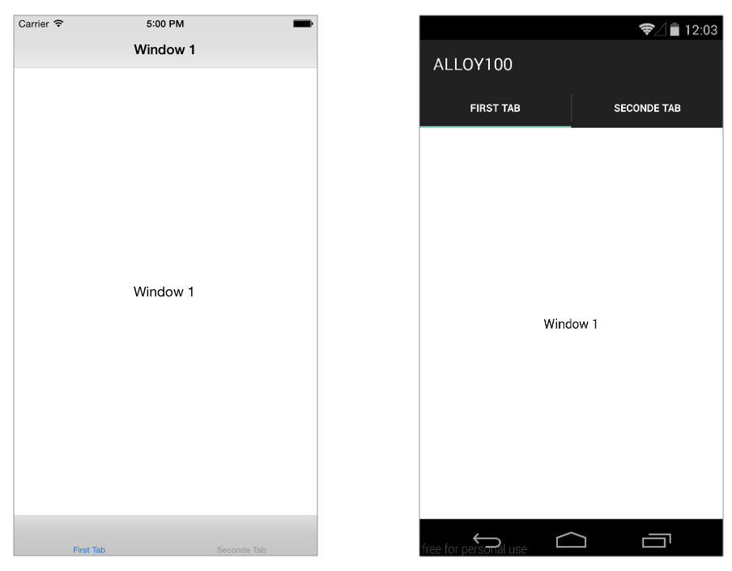

# ALLOY100

In this Lab Excercise you will apply the concepts learned in the ALLOY100 Module.

## Objective
Create a basic Two-tab Alloy app.  Tab 1 should be named **First Tab** and Tab 2 should be named **Second Tab**.  Inside the window for each tab add a label of these tabs, the windows will be named **window1.js** and **window2.js** respectively.

## Screenshot

## Resources

* [Finalized Project](http://github.com/appcelerator-training/learning-module-labs.zip)
