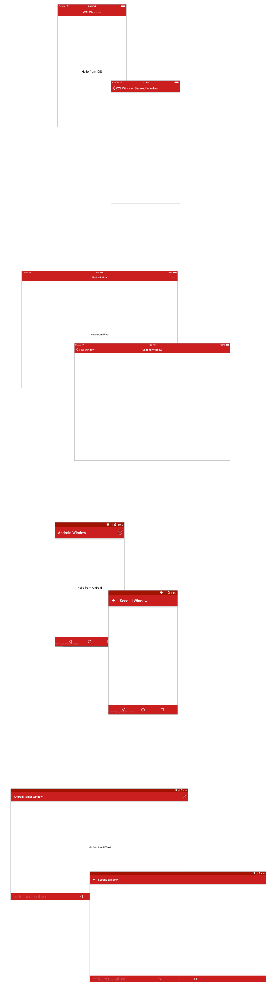

# ALLOY101

In this Lab Excercise you will apply the concepts learned in the ALLOY101 Module.

## Objective
Create an Alloy app skeleton that leverages Alloy's platform directives at the XML and TSS level, as well as platform-speific folders and platform conditionals at the controller level.  The app should be able to run on iPhone/iPod Touch, iPad, Android Phone and Android tablet, and be able to display a platform-specific greeting, while reusing your views, styles and controllers.

## Cheat Sheet

* Controller Level: 
	* Alloy.isTablet
	* OS_IOS
	* OS_ANDROID
* Stylesheet Level: 
	* platform=android
	* formFactor=handheld
* View Level : 
	*  formFactor="tablet"
	*  platform="android"

## Screenshot

## Resources

* [Finalized Project Repository](https://github.com/appcelerator-training/learning-modules-labs/tree/master/ALLOY100/ALLOY100)
