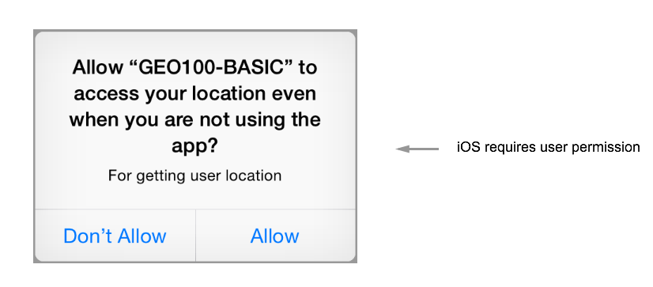
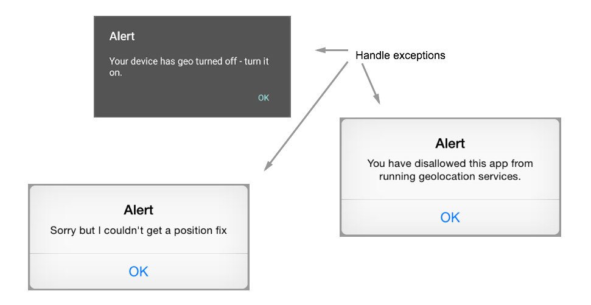
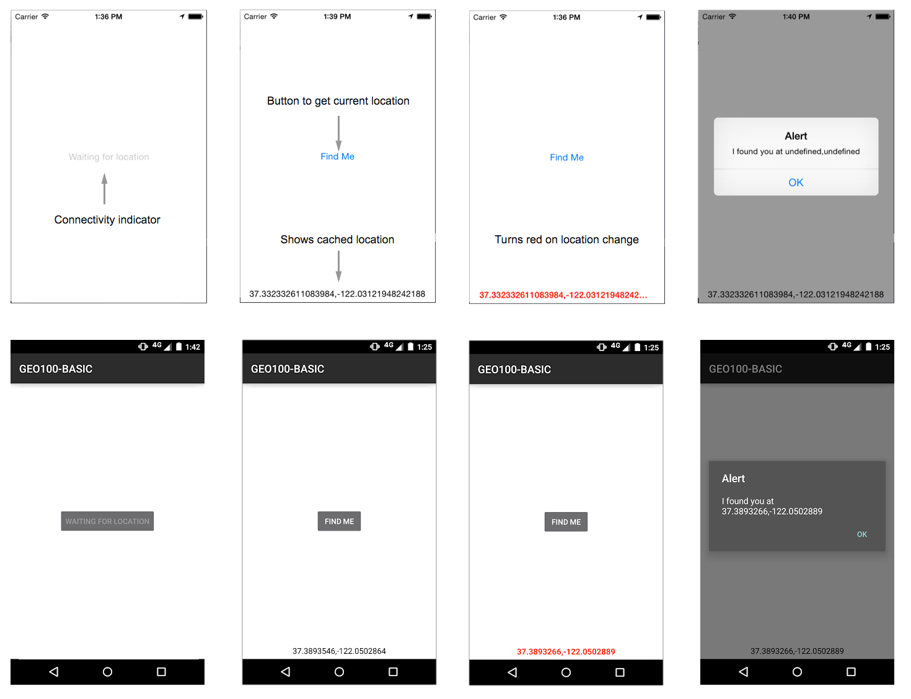
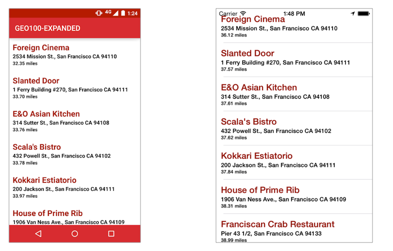

# GEO100
In this the sample code for the concepts learned in the GEO100 Module.  This module has two different sample projects.

# Basic
In this sample project you'll see how to implement the foundation required to make your app "location aware".

## iOS Settings
The iOS security model requires you to package your app specifying why you need access to location services.  To configure this, add the following to your **plist** inside ```tiapp.xml```.

```
<key>NSLocationAlwaysUsageDescription</key>
<string>
	For getting user location
</string>
```

Adding this code will tell your app to ask the user for authorization when the app is run for the first time.




### Handling common exceptions
When using location services, there are some exceptions your app should handle in order to provide the proper user feedback.  Properties to test for are:


```
Titanium.Geolocation.locationServicesEnabled
Titanium.Geolocation.locationServicesAuthorization
Titanium.Geolocation.AUTHORIZATION_RESTRICTED
```

These will give you the necessary data to show message boxes in case any exception is triggered.




### Responding to location changes

Every time you query the device's location, the coordinates will be cached.  From here on out, querying location will return these cached values.  To make sure you always get the most up-to-date location information, you need to add an event listener to the **location** event of the **Titanium.Geolocation object**.  

```
Titanium.Geolocation.addEventListener('location',function(e){})
```

This event is automatically fired when the device detects a change in location.

### App Screenshots


---

# Expanded

The expanded example uses the foundation put in place by the previous example in a practical context.

For this example, we use a list of restaurants, and display them in descending order of distance, much like **Foursquare** and **Yelp**.  For this we use a **[haversine](https://en.wikipedia.org/wiki/Haversine_formula)** formula that grabs the current location and the target location and returns the distance in kilometers.

```
function getDistance(lat1,lon1,lat2,lon2){
	var R 		= 6371; // earth's radius in km
	var dLat 	= toRad(lat2-lat1);
    var dLon 	= toRad(lon2-lon1);
    var lat1 	= toRad(lat1);
    var lat2 	= toRad(lat2);
	 
	var a 		= Math.sin(dLat/2) * Math.sin(dLat/2) + Math.sin(dLon/2) * Math.sin(dLon/2) * Math.cos(lat1) * Math.cos(lat2); 
	var c 		= 2 * Math.atan2(Math.sqrt(a), Math.sqrt(1-a)); 
	var d 		= R * c;
	return d;
}
```

### App Screenshots
