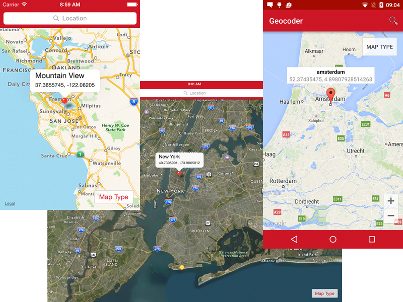
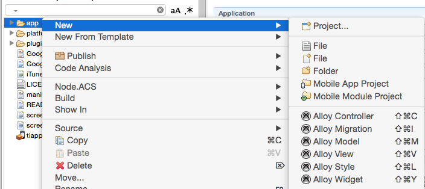
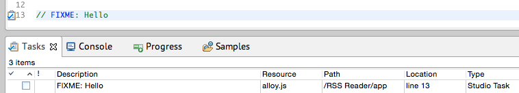

# Titanium Alloy Geocoder Sample
This is a Titanium Mobile sample app that uses native maps to plot locations. With it you can forward geocode addresses to add them as annotations, and reverse geocode your current position or via a longpress on the map.

As you'll [see](app/controllers/index.js) the code is heavily documented to tell you exactly what is going on.

Let's run through some of the main topics covered.

## Custom Android Material Theme
For Android, the app uses a [custom Android Material Theme](http://docs.appcelerator.com/platform/latest/#!/guide/Android_Themes-section-34636181_AndroidThemes-MaterialTheme). Material made it much easier to create custom Android themes and all you have to do is override some of the default colors in [platform/android/res/values/custom_theme.xml](platform/android/res/values/custom_theme.xml) and select the style name in [tiapp.xml](tiapp.xml) under *android/manifest/application@android:theme*.

* Guide: [Android Themes](http://docs.appcelerator.com/platform/latest/#!/guide/Android_Themes)

## Config: [config.json](app/config.json)
For iOS we wanted to make it easy to change our primary brand color as well. It's set in [app/config.json](alloy/app/config.json) under *global/brandPrimary* and read as `Alloy.CFG.brandPrimary` in [app/styles/index.tss](app/styles/index.tss) for example. As you can read in the guide, we could even set a different value for this propery based on the platform and environment the app runs on.

* Guide: [Project Configuration File (config.json)](http://docs.appcelerator.com/platform/latest/#!/guide/Project_Configuration_File_(config.json))

## Globals: [alloy.js](app/alloy.js)
Another global under Alloy is `Alloy.Globals`. This object is empty and can be populated anywhere, but in most cases you will use `alloy.js` for this. This fill end up in Titanium's bootstrap `Resources/app.js` file. Since that file is global scope, it's a best practice to wrap your code in a self-executing function.

For this app we detect if the user is running iOS7 or later and set a global to `20dp` if he is. We'll use this in a *Global Style* to move our content down below the statusBar, leaving the actual Window start behind it, allowing us to style it.

* Guide [Initializer File](http://docs.appcelerator.com/platform/latest/#!/guide/Alloy_Controllers-section-34636384_AlloyControllers-InitializerFile(alloy.js))

## Global Styles: [app.tss](app/styles/app.tss)
Even though this app only has one view, it's a best practice to use [app/styles/app.tss](app/styles/app.tss) for your base styles. It's an ideal place to override platform defaults, like the color of a `Label`, which is grey on Android instead of black like the others.

For this app this is also where play with the Window and canvas to give the statusBar a red backgroundColor. See *Globals* for more information.

* Guide: [Alloy Styles and Themes](http://docs.appcelerator.com/platform/latest/#!/guide/Alloy_Styles_and_Themes)

## Conditional Code
As the screenshots show, we use platform specific UI elements to provide the best user experience. Still, all platforms share the same [app/views/index.xml](app/views/index.xml). We use the `platform="<os>"` attribute to determine on which platform(s) a view (and it's descendants) should render. We also use conditional code in our [styles](app/styles/app.tss) and [controller](app/controllers/index.js).

* Guides:
  * [Views: Conditional Code](http://docs.appcelerator.com/platform/latest/#!/guide/Alloy_XML_Markup-section-35621528_AlloyXMLMarkup-ConditionalCode)
  * [Styles: Conditional Statements](http://docs.appcelerator.com/platform/latest/#!/guide/Alloy_Styles_and_Themes-section-35621526_AlloyStylesandThemes-ExampleusingConditionalStatements)
  * [Controllers: Conditional Code](http://docs.appcelerator.com/platform/latest/#!/guide/Alloy_Controllers-section-34636384_AlloyControllers-ConditionalCode)

## Map Module
Since 3.2.0 the core [Ti.Map](http://docs.appcelerator.com/platform/latest/#!/api/Titanium.Map) module for Google Maps v1 has been replaced by the add-on [ti.map](http://docs.appcelerator.com/platform/latest/#!/api/Modules.Map) module for Google Maps v2 and iOS Map Kit.

To use this module, we need to add it to [tiapp.xml](tiapp.xml) and use the powerful [module attribute/element](http://docs.appcelerator.com/platform/latest/#!/guide/Alloy_XML_Markup-section-35621528_AlloyXMLMarkup-ModuleAttribute) in our [index.xml](app/views/index.xml) to use the module as a view factory.

For Android, the module needs a [Google API key](http://docs.appcelerator.com/platform/latest/#!/guide/Google_Maps_v2_for_Android-section-36739898_GoogleMapsv2forAndroid-ObtainandAddaGoogleAPIKey), which is linked to the app id and keystore. The sample app includes a key for the sample app id and the bundled keystore that our SDKs default to.

* Guides:
  * [Map Module](http://docs.appcelerator.com/platform/latest/#!/api/Modules.Map)
  * [iOS Map Kit](http://docs.appcelerator.com/platform/latest/#!/guide/iOS_Map_Kit)

## CLI plugin
If you're in for some advanced stuff, check out [plugins/ti.map/1.0/hooks/map.js](plugins/ti.map/1.0/hooks/map.js). This is a Titanium CLI plugin that tries to help you out if you change the app id or use a different keystore. It will lookup the keystore fingerprint that you need to [obtain a Google API Key](http://docs.appcelerator.com/platform/latest/#!/guide/Google_Maps_v2_for_Android-section-36739898_GoogleMapsv2forAndroid-ObtainandAddaGoogleAPIKey).

The plug-in is added via the [tiapp.xml](tiapp.xml) and hooks into the `build.pre.construct` event. If you want to learn more about building CLI plugins, read the guide.

* Guide: [Titanium CLI Plugins](http://docs.appcelerator.com/platform/latest/#!/guide/Titanium_CLI_Plugins)

## Geolocation
To forward and reverse geocode locations on the map, we use `Ti.Geolocation`. This uses [MapQuest Open Nominatim Search Service](http://open.mapquestapi.com/nominatim/). While this API has the advantage that it has no daily usage limits, please note that the data backing this API is crowd sourced and might not return proper values for valid addresses and geographic coordinates. If geocoding services are essential component of the application, developers are encouraged to use commercial geocoding providers.

## Collections, Models & Data-Binding
You might wonder how the pins actually end up on the map. This is where Alloy's data-binding does its magic. Often seen as complex, it is in fact really easy when you get it, because Alloy does most of the work for you.

* Guide: [Alloy Models](http://docs.appcelerator.com/platform/latest/#!/guide/Alloy_Models), also on Collections, Data Binding and Sync Adapters

### Models
[Models](http://docs.appcelerator.com/platform/latest/#!/guide/Alloy_Collection_and_Model_Objects-section-36739589_AlloyCollectionandModelObjects-Models) can be seen as the rows of a table and the definition in [app/models/location.js](app/models/location.js) configures the columns and the connection to the data store. In our case we use the built-in `sql` adapter for storing models in a SQLite database.

To create a model right-click in the App/Project Explorer and start the *Alloy Model* wizard.

Via CLI you can use the generator:

	appc alloy generate model location sql title:TEXT longitude:REAL latitude:REAL
	
In [index.js](app/controllers/index.js) you can see how we:

	// create a model for the new location
	var model = Alloy.createModel('location', location);

	// save it to the data store
	model.save();

### Collections
[Collections](http://docs.appcelerator.com/platform/latest/#!/guide/Alloy_Collection_and_Model_Objects-section-36739589_AlloyCollectionandModelObjects-Collections) can be seen as tables or an array of models. They keep models and fire events if there are any changes. This is exactly what we need for data binding.

In [index.xml](app/views/index.xml) we create a new singleton instance of the location collection using the `<Collection />` tag. In [index.js](app/controllers/index.js) we can access this singleton via `Alloy.Collections.location` and call `fetch()` to load the existing models from the data store. This will trigger the data binding, just like the later call to `Alloy.Collections.location.add(model)` where we add a new location model to the collection.

### Data Binding
[Data binding](http://docs.appcelerator.com/platform/latest/#!/guide/Alloy_Data_Binding) simply comes down to listening to changes on an object and updating the UI accordingly. To activate this we add a `dataCollection` tag to the map's `<Module>` element in [index.xml](app/views/index.xml), telling Alloy which collection must be listened to and used to populate the map.

Unlike other types of data-binding we don't need to add a child view to bind model attributes. For a map, Alloy just assumes it can use the model with `createAnnotation()`. This is problematic when the model's attributes are not (all) this method expects. Fortunately we can hook in a `transformLocation()` function using the `dataTransform` attribute in the view.

## Strict Mode
All the functions in the [controller](app/controllers/index.js) begin with `'use strict';`. Although this app is simple, strict mode can dramatically increas the performance of your app because the JavaScript engine will assume as smaller, stricter subset of ECMAScript. Unfortunately you cannot add `'use strict';` as the first line of the controller because Alloy wraps your code where it is no longer the first line of the file or function. We're working on that.

## FIXME
Throughout the code you'll find a couple of `FIXME` or `TODO` comments. This is a standard way to document things that need to be fixed in a next release. Many editors, including Appcelerator Studio mark these lines and even collect them in a handy todo-list. 

If you include JIRA ticker number or full URL in a `FIXME` comment, you can use the [tickets CLI](npmjs.com/tickets) to quickly scan your project and lookup the current status of the issues. A great way to see if you can remove some workarounds after a new Titanium SDK release.
