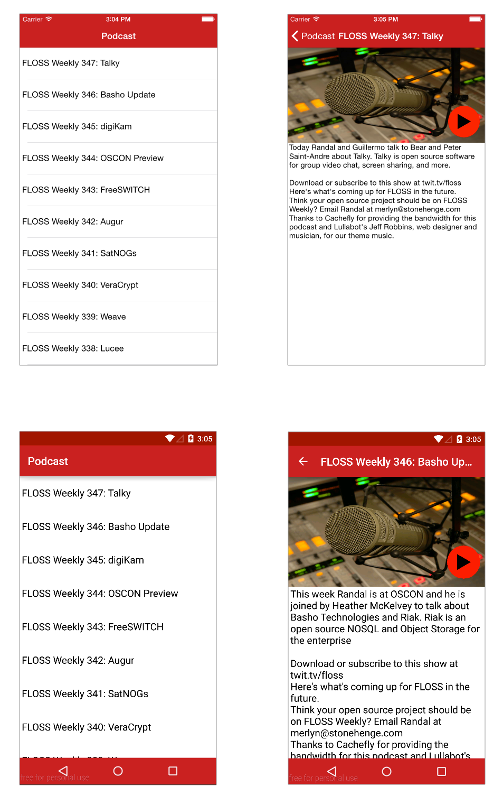

# MM100

In this Lab Excercise you will apply the concepts learned in the MM100 Module.

## Objective
Loren ipsum

## Cheat Sheet

* Con

## Screenshot

## Resources

* [Finalized Project Repository](https://github.com/appcelerator-training/learning-modules-labs/tree/master/ALLOY100/ALLOY100)
