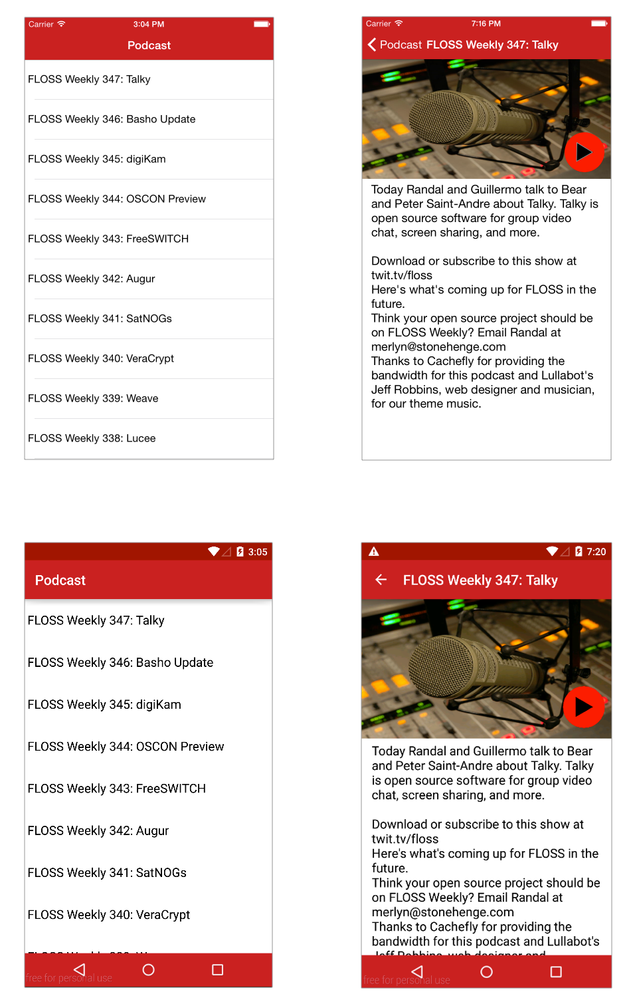

# MM100

In this sample app demonstrates the concepts learned in the MM100 Module.

## Description
This app is a simple **Podcast Player**.  The app implements a NavigationWindow on iOS and native windows on Android.  Includes a **parserss** module that provides an **experience based API** to grab the whole podcast feed, but only return the properties needed for the app.

## Screenshot

## Resources

* [Finalized Project Repository](https://github.com/appcelerator-training/learning-modules-labs/tree/master/ALLOY100/ALLOY100)
