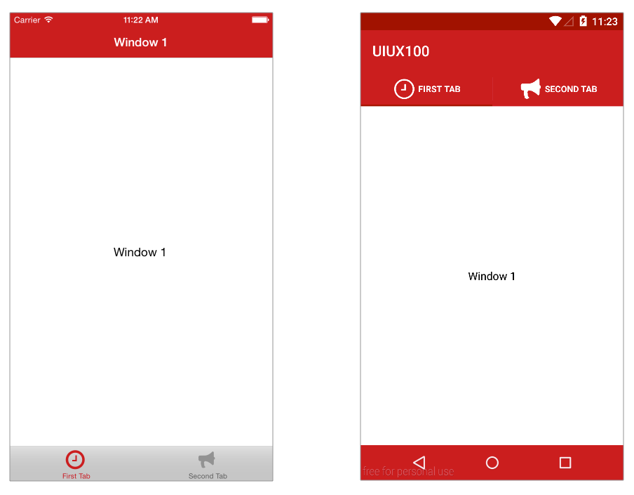

# UIUX100

In this Lab Excercise you will apply the concepts learned in the UIUX100 Module.

## Objective
Take the basic two-tab app created in ALLOY100 and apply platform-specific styling.  You'll be using iOS styling for the Navigation Bar, TabGroup, Tabs, as well as the Android Material Theme.  You'll also be using tab images designed for multiple device screen sizes and densities.

By the end of this lab you'll be able better understand and leverage the similarities and differences between iOS and Android native styling options.


## Screenshot




### iOS Status Bar on **tiapp.xml**

```
<key>UIStatusBarStyle</key>
<string>UIStatusBarStyleLightContent</string>
```

*[http://docs.appcelerator.com/platform/latest/#!/guide/tiapp.xml_and_timodule.xml_Reference-section-29004921_tiapp.xmlandtimodule.xmlReference-UIStatusBarStyle](http://docs.appcelerator.com/platform/latest/#!/guide/tiapp.xml_and_timodule.xml_Reference-section-29004921_tiapp.xmlandtimodule.xmlReference-UIStatusBarStyle)*

### Global **app.tss** (add more stuff?)

```
'Window': {
	backgroundColor: '#FFF'
}

'Window[platform=ios]': {
	barColor: '#CD1625',
	navTintColor: '#FFF',
	translucent: false,
	titleAttributes: {
		color: '#FFF'
	}
}

'Label': {
	color: '#000'
}
```

### Tab Icons

* sizes
* folder structure
* splash
* app icon

### Tabs Styling

* TabGroup
	* tabsTintColor
* Tab
	* titleColor
	* activeTitleColor
	* title
	* icon 

### Custom Android Material Theme

AppCompat built-in themes

```
<style name="LightDarkBar" parent="Theme.AppCompat.Light.DarkActionBar"/>
<style name="Light" parent="Theme.AppCompat.Light"/>
<style name="Dark" parent="Theme.AppCompat"/>
```

```
<?xml version="1.0" encoding="utf-8"?>
<resources>
	<style name="appcelerator" parent="@style/Theme.AppCompat">
		<item name="colorPrimary">#CD1625</item>
		<item name="colorAccent">#333333</item>
		<item name="colorControlActivated">#A30A00</item>
		<item name="android:statusBarColor">#A30A00</item>
		<item name="android:navigationBarColor">#CD1625</item>
	</style>
</resources>

```

```
<android xmlns:android="http://schemas.android.com/apk/res/android">
    <manifest>
        <application android:theme="@style/appcelerator"/>
        <uses-sdk android:minSdkVersion="14" android:targetSdkVersion="22"/>
    </manifest>
</android>
```

## Resources

* [Finalized Project Repository](https://github.com/appcelerator-training/learning-modules-labs/tree/master/ALLOY100/ALLOY100)

