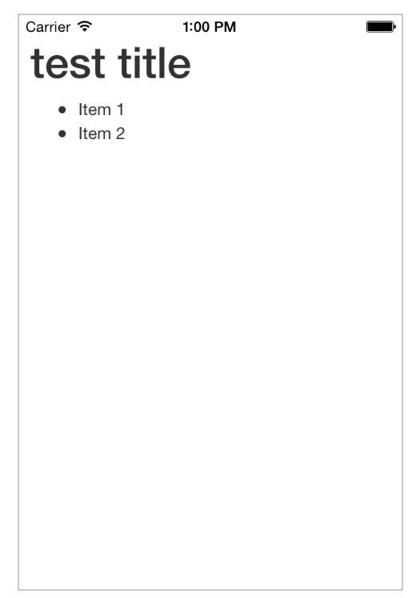

# WEBVIEW100

This example demonstrates the concepts learned in the WEBVIEW100 module.

## Sample

This sample app demonstrates using a WebView along with some web JavaScript libraries and CSS to render a Markdown document into HTML.

In the WIDGETS100 lesson we take this code and convert it into a reusable widget.

## Screenshot

